# System Health Toolkit (Windows)

Windows PowerShell scripts for quick diagnostics and health checks.

---

## 🖥️ System Health Report
- Script: `scripts/System-Health-Report.ps1`
- Collects OS version, uptime, CPU/RAM, disk usage, network adapters, IP configuration, and non-running services.
- Output saved to `logs/sysreport_TIMESTAMP.txt`.
- **Demo Screenshots:**  
Logs: 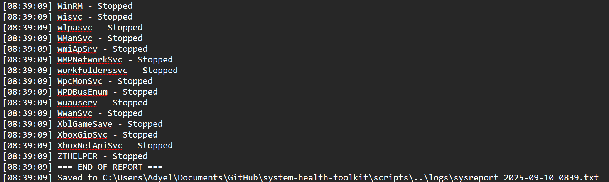  
PowerShell: 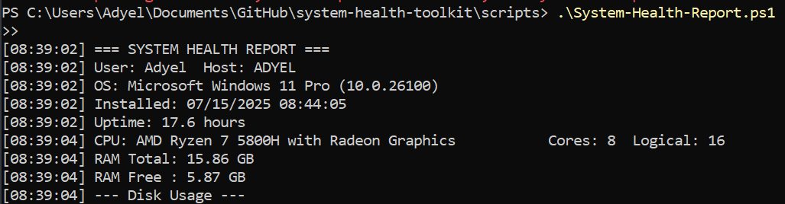

---

## 💾 Disk Health Check
- Script: `scripts/Disk-Health-Check.ps1`
- Reports health, size, media type (HDD/SSD), temperature, power-on hours, read/write errors, retries, and predictive failure.
- Output saved to `logs/diskhealth_TIMESTAMP.txt`.
- **Demo Screenshots:**  
Logs: 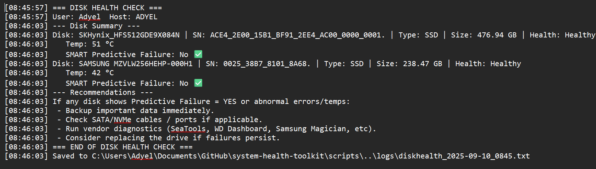  
PowerShell: 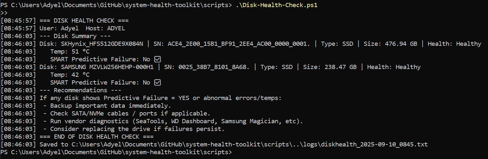

---

## 🔄 Windows Update Status
- Script: `scripts/Windows-Update-Status.ps1`
- Shows pending reboot state, recently installed updates, surfaces Windows Update errors, and scans for available updates.
- Output saved to `logs/winupdate_TIMESTAMP.txt`.
- **Demo Screenshots:**  
Logs: 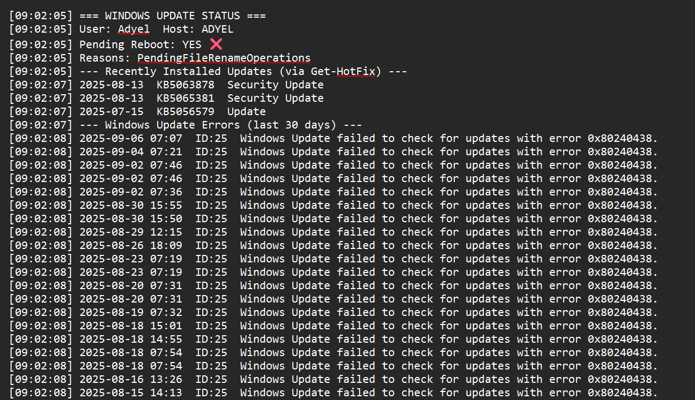  
PowerShell: 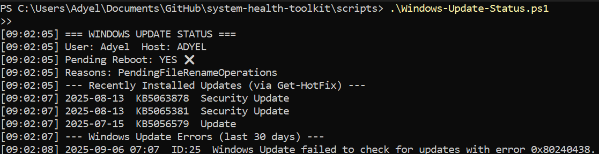  
Additional PowerShell view: 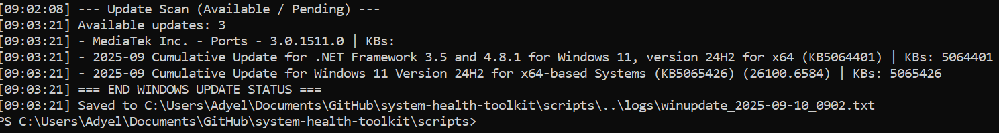

---

## ⚡ Startup Apps Report
- Script: `scripts/Startup-Apps-Report.ps1`
- Lists programs that launch at boot/login from Registry Run keys, Startup folders, Scheduled Tasks, and Automatic services.
- Output saved to `logs/startup_TIMESTAMP.txt`.
- **Demo Screenshots:**  
Logs: 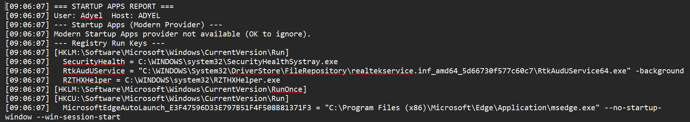  
PowerShell: 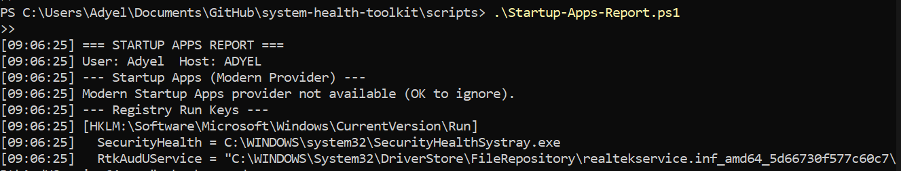

---

## 🌐 Network Connectivity Report
- Script: `scripts/Network-Connectivity-Report.ps1`
- Checks network adapter status, IP configuration, connectivity (ping tests), and DNS resolution.
- Output saved to `logs/network_TIMESTAMP.txt`.
- **Demo Screenshots:**  
Logs: 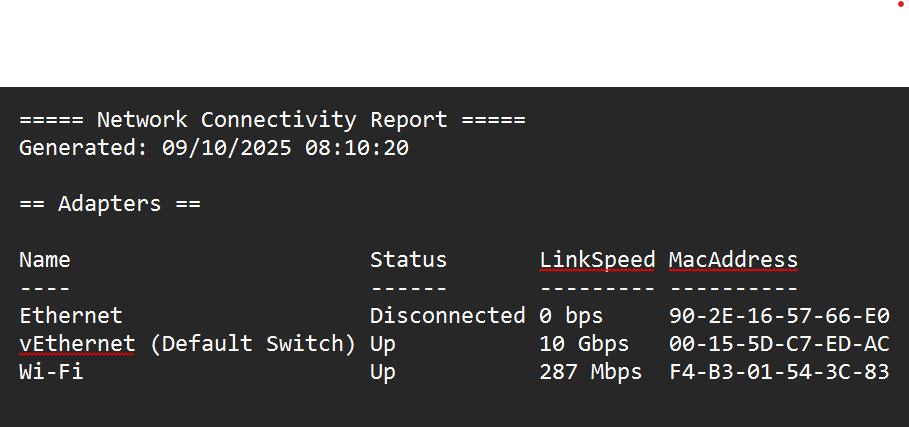  
PowerShell: 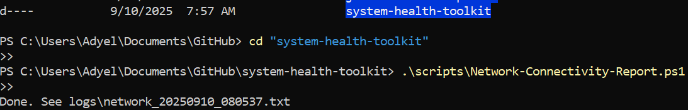
